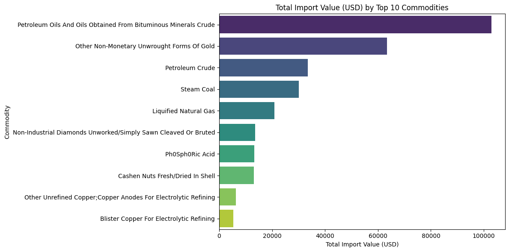

# Quick, simple guide to the notebook visuals

This short guide embeds a small set of representative figures so anyone (technical or non-technical) can understand the main story in the notebook in under a minute per figure.

Each figure below has three tiny parts:
- What you see — a one-line, simple description of the plot.
- Why it matters — one line about the insight.
- What to do next — one short actionable suggestion.

Images are stored in `docs/images/` (e.g., `fig_001.png`). If an image doesn't show in your viewer, open that file directly.

---

## 1. Distribution of values — fig_001.png

What you see: several boxplots showing how shipment quantities and values are distributed; a few very large points (outliers) jump out.

Why it matters: most shipments are small; a few very large shipments make totals look big. Those outliers can mislead averages.

What to do next: inspect the large outliers (by row) and decide if they're real trades or data errors. Use medians or trimmed means for summaries.

---

## 2. Monthly total import value — fig_015.png

What you see: a line chart of total import value (USD) per month showing trends and spikes.

Why it matters: spikes show months with unusually large imports; trend shows whether imports are generally growing or falling.

What to do next: if forecasting, use this to choose a model; investigate months with spikes for special events.

---

## 3. Top 10 countries by import value — fig_234.png

What you see: a bar chart of the countries that import the most (by USD).

Why it matters: shows which countries contribute most to total imports — useful for prioritizing analysis or reporting.

What to do next: focus deeper analysis (commodity mix, trends) on the top 3–5 countries first.

---

## 4. Top 10 commodities by value — fig_236.png

What you see: bar chart listing commodities that account for most import value.

Why it matters: a small set of commodities often drives most value; these are high-impact categories.

What to do next: drill into each top commodity to see seasonality and major trading partners.

---

## 5. Commodity composition for a country (example) — fig_134.png

What you see: pie chart showing how a single country's imports are split across the top commodities.

Why it matters: tells you what a country's import economy looks like at a glance.

What to do next: compare this with other countries to see specialization patterns.

---

## 6. Quantity vs USD value scatter — fig_240.png

What you see: scatter of shipment quantity (x) versus USD value (y). May be log-scaled.

Why it matters: you can see relationships between quantity and price — e.g., expensive items (high USD, low quantity) vs cheap bulk items (high quantity, low USD).

What to do next: compute price-per-unit and flag extreme prices for investigation.

---

## 7. Model diagnostics (Actual vs Predicted) — fig_193.png

What you see: predicted values plotted against actual values; a line shows perfect prediction.

Why it matters: closeness to the line means the model predicts well; deviations show where the model fails.

What to do next: if residuals are large for big USD values, try log-transforming the target or use tree-based models.

---

## 8. Anomaly detection summary — fig_225.png

What you see: a plot showing anomaly scores and highlighted top anomalies; the notebook also prints the top anomalous rows.

Why it matters: quickly find suspicious shipments (possible errors or unusual trades).

What to do next: review the top anomalous rows and decide whether to remove, correct, or treat them separately.

---

If this is the kind of simple, visual-first doc you want, I can:
- Embed more figures (all 261) in this simple format (will be long).
- Replace each figure with a country/commodity-labeled filename (semantic names) so the images are self-explanatory.
- Expand any figure's explanation into a short paragraph with exact code snippets from the notebook.

Tell me which of these three you'd like next (embed all / semantic rename / expand examples), or list specific figures to expand.
