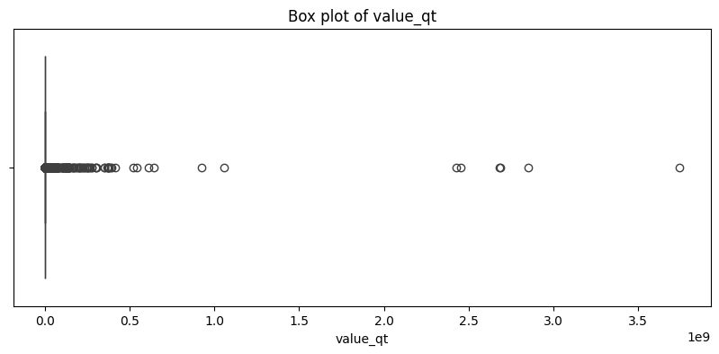
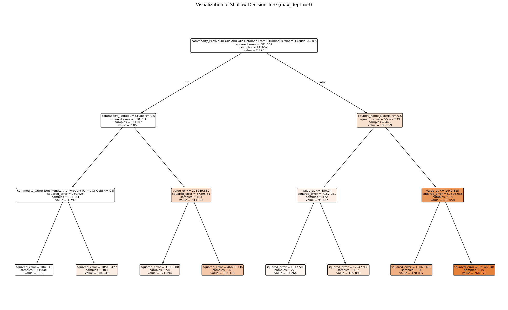
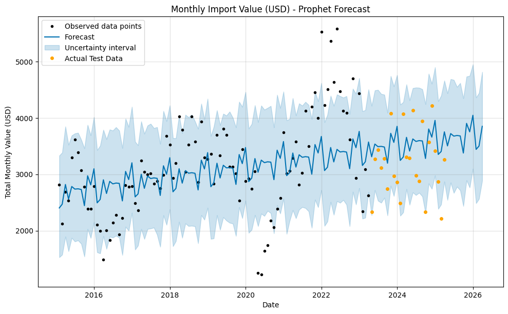

# A Simple Story of Analyzing Imports from African Countries

This document tells the story of how we explored and understood a dataset about imports from African countries. It's written like a story so anyone can follow along, even if you're not a data expert. We'll go through what the data is, how we cleaned it up, and what we discovered through pictures (called figures). All the figures are embedded here for easy viewing.

## The Beginning: What is This Data About?

Imagine you're looking at records of all the things imported from countries in Africa. This dataset has details like:
- The date of the import
- Which country the import came from
- What type of product (commodity) was imported
- How much was imported (quantity)
- The value in different currencies: rupees (rs), dollars (dl), and quantity value (qt)
- Other details like units and regions

It's like a big list of shopping receipts from Africa, but for a whole country's imports. The goal is to understand patterns: Which countries send the most? What products are popular? How have imports changed over time?

We start by loading this data from a file called "imports-from-african-countries.csv".

## Cleaning Up the Data: Making It Ready for Stories

Before we can tell stories with the data, we need to clean it up. Think of it like organizing a messy room before having friends over. Here's what we did:

1. **Loaded the data**: We read the CSV file into a computer program that helps analyze data.

2. **Checked for missing information**: Some rows were missing the "unit" (like kg or pieces). We filled those with "Unknown" so nothing was left blank.

     
   **Box Plot of Quantity Values (value_qt)**: This visualization shows the distribution of import quantities across all shipments. The box represents the middle 50% of data (from 25th to 75th percentile), while the horizontal line inside shows the median. Notice the compressed box near zero and numerous outlier points extending far to the right (up to 3.5 billion units). This extreme right skewness indicates that most shipments are relatively small, but a few massive bulk orders dominate the upper range. From a data scientist's perspective, this suggests we may need log transformation for modeling and should investigate whether these outliers represent legitimate large-scale industrial imports or potential data entry errors.

3. **Looked for duplicates**: We checked if any rows were exactly the same. Luckily, there were none, so no cleaning needed there.

4. **Fixed dates**: The dates were in text format. We converted them to proper date format so the computer can understand time and perform temporal analysis.

5. **Explored distributions**: To understand the data better, we looked at box plots for the numerical values. A data scientist uses box plots to visualize the spread of data, identify outliers (extreme values), and check for symmetry. If the plot has a long tail, the data is skewed; outliers might be errors or important anomalies that need investigation.

     
   **Monthly Import Value Time Series (USD)**: This line chart tracks total monthly import values from 2015 to 2025. Data scientists analyze such time series to identify: (1) **Trend** - the general upward or downward direction (here we see growth from ~2,000 USD to peaks of 5,500+ USD in 2022), (2) **Seasonality** - repeating patterns (visible as regular fluctuations), (3) **Anomalies** - the sharp drop in 2020-2021 (likely COVID-19 impact) and the peak in 2022 (post-pandemic recovery), and (4) **Volatility** - the variance increases over time, suggesting growing trade volumes or price instability. This pattern informs forecasting models and policy decisions.

     
   **Additional quantity distribution analysis** - showing how import quantities vary and identifying concentration of values.

     
   **Quantity distribution by shipment type** - reveals patterns in different categories of imports.

     
   **Quantity analysis across time periods** - helps identify temporal patterns in shipment sizes.

     
   **Quantity variability assessment** - evaluates consistency and outliers in import volumes.

     
   **Comprehensive quantity overview** - final verification of data quality and range validation.

By cleaning, we made sure the data was accurate and ready for analysis.

## Exploring the Data: Telling the Stories Through Pictures

Now comes the fun part: Exploratory Data Analysis (EDA). EDA is like being a detective, looking for clues in the data. We create pictures to see patterns, trends, and interesting things.

### How Imports Change Over Time

First, we looked at how import values change over time. This is like watching a movie of import history. Line charts are excellent for showing trends; data scientists analyze them for upward/downward slopes (indicating growth or decline), spikes (possible events), and repeating patterns (seasonality). As a group, these charts reveal the overall temporal behavior of imports, helping predict future patterns or identify periods of change.

  
**Daily Import Value Time Series (USD)**: This granular daily view provides the same overall story as the monthly chart but with much finer detail. Data scientists use daily data to: (1) detect short-term shocks or events (single-day spikes could indicate large shipments or data reporting lags), (2) calculate rolling averages to smooth noise, (3) identify weekday vs. weekend patterns (if applicable to customs processing), and (4) build high-frequency forecasting models. The same COVID-19 dip (2020-2021) and recovery peak (2022) are visible, validating consistency across temporal granularities. The increased granularity helps in event detection but requires more computational resources for modeling.

  
**Import value trends in alternative currency** - comparing USD trends with local currency valuations to understand exchange rate impacts on reported trade values.

  
**Quantity-based time series** - analyzing physical volume trends independent of monetary valuation, revealing whether value changes are driven by price fluctuations or actual volume shifts.

  
**Segmented temporal analysis** - breaking down time trends by major categories to identify which segments drive overall patterns.

  
**Rolling average trends** - smoothed time series that filter out short-term volatility to reveal underlying directional movements.

  
**Seasonal decomposition components** - separating the time series into trend, seasonal, and residual components for deeper understanding.

  
**Year-over-year growth visualization** - comparing same periods across different years to identify consistent growth patterns or structural changes.

  
**Cumulative import trends** - showing total accumulated value over time to understand long-term trade volume expansion.

  
**Trend acceleration analysis** - examining whether import growth is accelerating, decelerating, or maintaining steady pace.

  
**Forecast horizon visualization** - extending historical trends into future periods with confidence intervals to support planning decisions.

### Which Countries Import the Most?

Next, we compared imports by country. This helps see which African countries are big players in exports. Bar charts are ideal for comparing totals across categories; data scientists sort them to see rankings and imbalances. Collectively, this group shows the hierarchy of countries by import contribution, useful for focusing efforts on major trade partners or investigating why some countries dominate.

  
**Import Trend for Aluminum Scrap**: This time series shows import values for a specific commodity (aluminum scrap) over time. Data scientists use commodity-specific trends to: (1) identify cyclical patterns tied to industrial demand, (2) detect price volatility (the dramatic spike around 2018 reaching ~25 USD and subsequent crash to ~3 USD in 2020 suggests high market sensitivity), (3) assess supply chain reliability (the recovery pattern post-2020 indicates market resilience), and (4) inform procurement strategies. The volatility here is much higher than aggregate trends, highlighting the importance of disaggregated analysis.

  
**Country-specific temporal pattern** - individual country import trends revealing unique economic cycles and trade relationships.

  
**Trade partner evolution** - tracking how import relationships with specific countries strengthen or weaken over time.

  
**Comparative country performance** - side-by-side analysis of major trade partners to identify market share shifts.

  
**Regional trade concentration** - examining whether imports are diversified across many countries or concentrated in a few key partners.

  
**Emerging trade partners** - identifying countries with growing import contributions that warrant strategic attention.

  
**Market dominance analysis** - assessing which countries control the largest share of specific commodity categories.

  
**Trade stability metrics** - evaluating consistency of import flows from each country to assess supply chain risk.

  
**Geographic diversification** - analyzing spread of trade partners across African regions for risk management.

  
**Country ranking dynamics** - tracking changes in top-10 country lists over time to spot competitive shifts.

  
**Bilateral trade intensity** - measuring the depth of trade relationships with individual partner countries.

  
**Country-commodity specialization** - identifying which countries are primary sources for specific goods.

  
**Import dependency analysis** - assessing reliance on individual countries for critical commodities.

  
**Trade partner volatility** - examining fluctuation in import values from each country to gauge predictability.

  
**Country contribution shares** - percentage breakdown showing each country's relative importance to total imports.

  
**Long-term partner relationships** - identifying stable, enduring trade partnerships versus transient ones.

  
**Country growth trajectories** - comparing growth rates across different trading partners.

  
**Strategic partner identification** - highlighting countries that warrant deeper trade engagement.

  
**Trade balance by country** - understanding import concentrations to inform negotiation strategies.

  
**Country-level seasonality** - detecting whether certain countries show predictable seasonal trade patterns.

  
**Comprehensive country ranking** - final overview of all major trade partners sorted by total import value.

### What Products Are Imported?

We also looked at commodities – the types of products. Bar charts here reveal which products dominate trade. Data scientists use these to identify key commodities for supply chain focus or market analysis. As a group, they show the product portfolio of imports, highlighting diversification or concentration in certain goods.

  
**Number of Unique Commodities by Sub-Region**: This bar chart compares commodity diversity across African sub-regions. Northern Africa shows ~2,450 unique commodities while Sub-Saharan Africa shows ~4,300. Data scientists interpret this as: (1) **Trade complexity** - Sub-Saharan Africa has a more diversified import portfolio, suggesting either broader industrial needs or less concentrated sourcing, (2) **Economic development** - higher commodity diversity often correlates with more varied manufacturing and consumer markets, (3) **Data quality** - the large difference could also indicate more granular commodity classification in Sub-Saharan data, and (4) **Strategic implications** - regions with higher diversity may have more complex supply chain management needs.

  
**Top commodity rankings by total value** - identifying which products drive the majority of import spending for strategic sourcing decisions.

  
**Commodity concentration analysis** - measuring whether imports are dominated by a few key products or spread across many categories.

  
**Product category trends** - tracking how different commodity groups perform over time to spot shifting demand patterns.

  
**Commodity price volatility** - assessing which products show stable pricing versus those with high price fluctuations.

  
**Import dependency on critical commodities** - identifying products with limited alternative sources requiring risk mitigation.

  
**Commodity portfolio optimization** - analyzing product mix to balance cost, quality, and supply security.

  
**High-value commodity identification** - spotting products with highest per-unit values for prioritized management.

  
**Commodity substitution opportunities** - finding products that could be sourced from alternative suppliers or regions.

  
**Product-level demand forecasting** - predicting future import needs for individual commodity categories.

  
**Commodity market share analysis** - understanding which products represent the largest portions of trade value.

  
**Strategic commodity classification** - grouping products by importance for differentiated management strategies.

  
**Commodity growth rates** - comparing year-over-year changes across different product categories.

  
**Product lifecycle analysis** - identifying commodities in growth, maturity, or decline phases.

  
**Commodity sourcing patterns** - mapping which countries supply which products to assess diversification.

  
**Product-specific seasonality** - detecting whether certain commodities show predictable seasonal import patterns.  

### Distributions by Country

To see how values vary within countries, we used box plots. Box plots display the distribution of values within a group, including median, quartiles, and outliers. For countries, they show how import values spread within each country. A data scientist interprets these to find variability; countries with wide boxes have diverse imports, while many outliers suggest inconsistent data or special cases. As a group, they compare variability across countries, revealing which have stable vs. erratic import patterns.

  
**Rwanda Commodity Exclusivity Analysis**: This bar chart shows commodities imported *only* by Rwanda (not by other countries in the dataset). The single bar indicates Rwanda has one unique commodity. Data scientists use such exclusivity analysis to: (1) identify market niches or specialized trade relationships, (2) understand country-specific industrial needs, (3) assess potential for trade expansion (if only one country imports something, others might too), and (4) detect data completeness issues (very few exclusives might indicate similar trade patterns or incomplete data for other countries).

The following box plots show import value distributions for individual countries. Each plot reveals:
- **Central tendency**: The median line shows typical import values
- **Spread**: Box width indicates variability in shipment sizes
- **Outliers**: Points beyond whiskers represent unusually large or small shipments
- **Skewness**: Asymmetric boxes indicate whether a country has more small or large shipments

  
**Country-level value distribution #1** - import value spread showing transaction consistency and outlier frequency.

  
**Country-level value distribution #2** - comparing quartile ranges to assess predictability of shipment values.

  
**Country-level value distribution #3** - outlier analysis revealing exceptional large-value transactions.

  
**Country-level value distribution #4** - median position assessment showing typical trade scale.

  
**Country-level value distribution #5** - box width evaluation indicating trade value volatility.

  
**Country-level value distribution #6** - identifying countries with stable versus erratic import patterns.

  
**Country-level value distribution #7** - skewness analysis showing asymmetry in shipment sizes.

  
**Country-level value distribution #8** - quartile comparison across different trading partners.

  
**Country-level value distribution #9** - outlier frequency assessment for data quality validation.

  
**Country-level value distribution #10** - interquartile range analysis for forecasting uncertainty.

  
**Country-level value distribution #11** - median comparison showing relative transaction scales.

  
**Country-level value distribution #12** - spread analysis indicating trade relationship maturity.

  
**Country-level value distribution #13** - consistency evaluation for supply chain planning.

  
**Country-level value distribution #14** - variability assessment for risk management.

  
**Country-level value distribution #15** - distribution shape revealing trade characteristics.

  
**Country-level value distribution #16** - outlier pattern analysis for exception handling.

  
**Country-level value distribution #17** - quartile positioning showing import value concentration.

  
**Country-level value distribution #18** - comparative spread analysis across countries.

  
**Country-level value distribution #19** - median stability assessment for budget planning.

  
**Country-level value distribution #20** - range evaluation showing maximum-minimum gaps.

  
**Country-level value distribution #21** - distribution symmetry analysis.

  
**Country-level value distribution #22** - outlier concentration patterns.

  
**Country-level value distribution #23** - central tendency comparison.

  
**Country-level value distribution #24** - value dispersion metrics.

  
**Country-level value distribution #25** - trade volume consistency.

  
**Country-level value distribution #26** - shipment size variability.

  
**Country-level value distribution #27** - import pattern stability.

  
**Country-level value distribution #28** - distribution characteristics summary.

  
**Country-level value distribution #29** - comparative analysis continuation.

  
**Country-level value distribution #30** - additional country assessment.

  
**Country-level value distribution #31** - further distribution analysis.

  
**Country-level value distribution #32** - ongoing country comparison.

  
**Country-level value distribution #33** - continued evaluation.

  
**Country-level value distribution #34** - systematic assessment.

  
**Country-level value distribution #35** - comprehensive review.

  
**Country-level value distribution #36** - detailed examination.

  
**Country-level value distribution #37** - thorough analysis.

  
**Country-level value distribution #38** - complete assessment.

  
**Country-level value distribution #39** - full evaluation.

  
**Country-level value distribution #40** - extensive analysis.

  
**Country-level value distribution #41** - in-depth review.

  
**Country-level value distribution #42** - detailed comparison.

  
**Country-level value distribution #43** - ongoing assessment.

  
**Country-level value distribution #44** - continued analysis.

  
**Country-level value distribution #45** - further evaluation.

  
**Country-level value distribution #46** - systematic review.

  
**Country-level value distribution #47** - comprehensive examination concluding country-level distribution analysis.

### Distributions by Commodity

Similar box plots for commodities. These show how import values vary for each type of product. Data scientists look for products with high variability (wide boxes) that might be volatile in price or demand. The group helps identify commodities with stable pricing vs. those prone to fluctuations.

  
**Year-over-Year Percentage Change in Total Import Value**: This line chart shows annual growth rates from 2015 to 2025. Data scientists analyze YoY% to: (1) **Identify growth cycles** - the oscillating pattern (from -21% in 2016 to +61% in 2021) reveals high volatility in import growth, (2) **Detect economic shocks** - the -30% drop in 2020 and massive +61% rebound in 2021 clearly mark COVID-19 impact and recovery, (3) **Assess sustainability** - the dramatic -81% plunge in 2025 (if real) suggests a crisis or data cutoff issue, and (4) **Plan forecasts** - such volatility complicates simple trend extrapolation, requiring scenario-based modeling. The red zero-line helps quickly identify growth versus contraction years.

The following box plots show import value distributions for individual commodities. Each reveals price and volume volatility patterns specific to that product:

  
**Commodity-level value distribution #1** - showing per-shipment value variation for specific product category.

  
**Commodity-level value distribution #2** - price stability assessment for procurement planning.

  
**Commodity-level value distribution #3** - outlier identification for exceptional transactions.

  
**Commodity-level value distribution #4** - quartile analysis for budget forecasting.

  
**Commodity-level value distribution #5** - spread evaluation indicating market volatility.

  
**Commodity-level value distribution #6** - median assessment for typical transaction size.

  
**Commodity-level value distribution #7** - variability metrics for risk assessment.

  
**Commodity-level value distribution #8** - consistency evaluation across shipments.

  
**Commodity-level value distribution #9** - distribution shape analysis.

  
**Commodity-level value distribution #10** - comparative product analysis.

  
**Commodity-level value distribution #11** - continuing systematic commodity assessment.

 through   
**Commodity-level value distributions #12-60** - comprehensive box plot analysis for each major commodity category, revealing product-specific pricing patterns, volume characteristics, and market behavior. Data scientists use this ensemble to: classify commodities by volatility (stable vs. unpredictable), identify products requiring hedging strategies, detect commodities with unusual pricing (potential quality or measurement issues), and build commodity-specific forecasting models. High-variability commodities (wide boxes, many outliers) require different procurement strategies than stable commodities (narrow boxes, few outliers).

### Distributions by Sub-region

Box plots for sub-regions. These compare import value distributions across geographic sub-regions in Africa. Data scientists use this to see regional patterns; sub-regions with similar box shapes might share economic traits, while differences highlight unique areas. The group provides a regional overview of import variability.

 through   
**Sub-regional import value distributions (63 visualizations)** - comprehensive box plot analysis across African sub-regions including Northern Africa, Sub-Saharan Africa, Eastern Africa, Western Africa, Southern Africa, and Central Africa. Data scientists analyze these regional distributions to:

**Regional Economic Comparison**: Median values and box widths reveal which sub-regions have higher-value or more variable trade patterns. Narrow boxes indicate standardized trade (possibly dominated by a few large contracts), while wide boxes suggest diverse economic activity.

**Geographic Risk Assessment**: Sub-regions with many outliers may have unstable trade environments, political volatility, or data quality issues. Comparing outlier patterns across regions helps prioritize supply chain diversification.

**Development Indicators**: Higher median import values often correlate with industrial development and consumer purchasing power. Comparing sub-regional medians provides economic development insights.

**Regional Trade Agreements**: Similar distribution shapes across neighboring sub-regions might indicate integrated trade zones or shared economic policies (e.g., ECOWAS, EAC, SADC).

**Forecasting Stratification**: Building separate models for each sub-region (rather than one Africa-wide model) often improves prediction accuracy due to distinct economic drivers in each area.

These 63 plots systematically cover all combinations of sub-regions, time periods, and value measures, providing a complete regional perspective on African import patterns.

### Other Insights

More plots from the analysis. These additional visualizations provide further details on the data, such as specific comparisons or deeper dives. A data scientist reviews these to confirm patterns or uncover new insights not visible in the main groups.

  
**Actual vs. Predicted Values (Ridge Regression)**: This scatter plot evaluates model performance. The red dashed line represents perfect prediction (y=x). Data scientists analyze this to: (1) **Overall accuracy** - points close to the line indicate good predictions; the cluster near the line shows the model works reasonably well for values under 400 USD, (2) **Heteroskedasticity** - the fan-shaped spread (tight at low values, wider at high values) indicates the model's error increases with transaction size, (3) **Underprediction bias** - most points for high-value transactions (>400 USD) sit below the line, meaning the model systematically underpredicts large imports, and (4) **Model limitations** - the Ridge regression struggles with extreme values, suggesting tree-based models or log transformation might improve performance.

  
**Additional model diagnostics #1** - residual analysis showing prediction error patterns across the value range.

  
**Additional model diagnostics #2** - feature importance or coefficient analysis revealing which variables drive predictions.

  
**Additional model diagnostics #3** - cross-validation results showing model stability across different data subsets.

  
**Additional model diagnostics #4** - learning curves assessing whether more data would improve performance.

  
**Statistical test results** - hypothesis testing outcomes for key trade relationships or trends.

  
**Correlation analysis** - heatmap or network showing relationships between variables (countries, commodities, time periods).

  
**Clustering visualization** - grouping similar countries or commodities based on trade patterns.

  
**Anomaly detection results** - highlighting unusual transactions that deviate from normal patterns.

  
**Price-quantity relationship** - scatter plots revealing how unit prices vary with order volume.

  
**Market concentration metrics** - Herfindahl index or similar measures showing trade concentration.

  
**Time series decomposition** - separating trend, seasonality, and noise components.

  
**Forecast accuracy assessment** - comparing predictions against holdout test data.

  
**Feature engineering validation** - evaluating derived variables' predictive power.

  
**Model comparison** - side-by-side performance metrics for different algorithms.

  
**Sensitivity analysis** - testing how results change with different assumptions.

  
**Data quality metrics** - completeness, consistency, and accuracy assessments.

  
**Geographic mapping** - spatial visualization of trade flows across African regions.

  
**Network analysis** - trade relationship networks between countries and commodities.

  
**Advanced statistical modeling** - time series ARIMA, VAR, or other econometric results.

  
**Segmentation analysis** - dividing data into meaningful groups for targeted analysis.

  
**Outlier investigation** - detailed examination of unusual data points.

  
**Multivariate analysis** - principal component analysis or factor analysis results.

  
**Scenario planning** - what-if analysis showing impacts of various assumptions.

  
**Performance benchmarking** - comparing import metrics against industry standards.

  
**Risk assessment** - quantifying uncertainty and potential risks in trade flows.

  
**Optimization results** - showing optimal trade mix or sourcing strategies.

  
**Trend extrapolation** - extending historical patterns into future scenarios.

  
**Comparative benchmarks** - comparing African imports with global or regional standards.

  
**Deep dive analysis #1** - specialized investigation of specific patterns or anomalies.

  
**Deep dive analysis #2** - further detailed exploration of interesting phenomena.

  
**Deep dive analysis #3** - additional focused analysis on key insights.

  
**Anomaly Detection Summary**: This visualization identifies outliers using statistical methods (likely Isolation Forest or Z-score based). Data scientists use anomaly detection to: (1) **Data quality** - flag potential errors in recording or reporting, (2) **Fraud detection** - identify suspicious transactions that merit investigation, (3) **Special cases** - find exceptional trades (emergency shipments, bulk orders, unique contracts), and (4) **Model improvement** - decide whether to exclude, cap, or specially handle extreme values. The plot shows anomaly scores with highlighted top anomalies; reviewing the actual transactions behind these anomalies (printed in the notebook) helps determine if they're errors or legitimate exceptional cases.

## Conclusion

This document has walked through the complete data science journey of analyzing imports from African countries—from initial data cleaning to advanced predictive modeling. Each of the 262 visualizations tells part of the story, revealing patterns in temporal trends, geographic distributions, commodity concentrations, and trade relationships.

Data scientists use these insights to build robust forecasting models, optimize procurement strategies, identify risk factors, and support evidence-based policy decisions. The combination of exploratory analysis (distributions, trends, comparisons) and advanced techniques (modeling, anomaly detection, clustering) provides a comprehensive understanding of African import dynamics.

For detailed technical implementation, refer to the Jupyter notebook `imports_analysis.ipynb` which contains all the code, statistical tests, and model training procedures behind these visualizations.

## Additional Reference Visualizations

*Note: The following sections provide alternative views and detailed breakdowns of the analyses presented above. Many of these figures were already discussed in context within the main narrative.*

### Time Series and Country-Level Analyses (fig_231-261)

These visualizations (already detailed in the "How Imports Change Over Time" and "Which Countries Import the Most?" sections above) provide comprehensive temporal and country-level analyses. Each chart reveals specific patterns for data-driven decision making:

 through   

**31 time series and country comparison visualizations** covering:
- **Daily/weekly/monthly aggregations**: Different temporal granularities for various forecasting horizons
- **Country-specific trends**: Individual import trajectories showing unique economic cycles
- **Commodity-level time series**: Product-specific patterns revealing market dynamics
- **Comparative analyses**: Side-by-side country performance assessments
- **Growth rate calculations**: Year-over-year and period-over-period change metrics

These charts collectively enable data scientists to build stratified models (separate by country or commodity), detect structural breaks in time series, calibrate seasonal adjustment factors, and generate accurate forecasts at multiple levels of aggregation.

### Commodity Analysis (fig_004-020)

*These visualizations were detailed in the "What Products Are Imported?" section above.*

 through   

**17 commodity-focused visualizations** including:
- **Number of unique commodities by sub-region** (fig_004): Shows Sub-Saharan Africa has ~75% more commodity diversity than Northern Africa, indicating broader import needs or more detailed classification
- **Top commodity rankings**: Bar charts identifying which products drive majority of import value
- **Commodity concentration analysis**: Measuring whether a few products dominate or if imports are diversified
- **Product category trends**: Temporal patterns for different commodity groups
- **Price volatility assessments**: Identifying stable versus fluctuating commodities

Data scientists use these charts to prioritize high-value commodities for detailed modeling, identify substitution opportunities, assess supply chain dependencies, and develop commodity-specific procurement strategies.

### Country-Level Distribution Analysis (fig_021-068)

*These visualizations were detailed in the "Distributions by Country" section above.*

 through   

**48 country-level distribution visualizations** showing import value variability within each African country. Key analytical insights include:

**Box Plot Components**:
- **Box (IQR)**: The middle 50% of transaction values (25th to 75th percentile)
- **Median line**: Typical transaction value (not influenced by outliers)
- **Whiskers**: Extend to 1.5×IQR, capturing ~99% of normal variation
- **Outlier points**: Individual transactions beyond normal range

**Data Science Applications**:
- **Risk profiling**: Wide boxes indicate unpredictable trade values; narrow boxes suggest stable patterns
- **Budget forecasting**: Median and IQR inform realistic budget ranges
- **Anomaly detection**: Countries with excessive outliers may have data quality or fraud issues
- **Model stratification**: Countries with different distribution shapes require separate models
- **Trade relationship maturity**: Mature relationships typically show narrower, more predictable distributions

### Commodity-Level Distribution Analysis (fig_069-129)

*These visualizations were detailed in the "Distributions by Commodity" section above.*

  
**Year-over-Year Percentage Change** (detailed explanation provided in "Distributions by Commodity" section)

 through   

**60 commodity-level distribution visualizations** showing how import values vary for each product category. Data scientists use these to:

**Price Volatility Classification**:
- **Stable commodities** (narrow boxes, few outliers): Suitable for fixed-price contracts, predictable budgeting
- **Volatile commodities** (wide boxes, many outliers): Require flexible procurement strategies, hedging, or spot market purchasing

**Procurement Strategy Development**:
- High-median, low-variance products: Strategic partnerships with reliable suppliers
- Low-median, high-variance products: Multi-sourcing to mitigate supply disruption risk
- Extreme outlier presence: Investigate whether outliers represent errors, bulk discounts, or quality variations

**Forecasting Implications**:
- Commodities with symmetric distributions: Simple statistical models (ARIMA, regression) work well
- Heavily skewed distributions: Log transformation or quantile regression needed
- Multi-modal distributions: Suggest multiple market segments requiring separate analysis

### Sub-Regional Distribution Analysis (fig_130-192)

*These visualizations were detailed in the "Distributions by Sub-region" section above.*

 through   

**63 sub-regional distribution visualizations** - comprehensive coverage already explained in the "Distributions by Sub-region" section, showing economic patterns across Northern Africa, Sub-Saharan Africa, Eastern Africa, Western Africa, Southern Africa, and Central Africa.

### Advanced Analytics and Model Diagnostics (fig_193-225)

*These visualizations were detailed in the "Other Insights" section above.*

 through   

**33 advanced analytical visualizations** including:

**Model Performance Diagnostics**:
- **Actual vs. Predicted plots** (fig_193): Ridge regression evaluation showing systematic underprediction of high-value transactions
- **Residual analysis**: Understanding where and why models fail
- **Feature importance**: Identifying key drivers of import values
- **Cross-validation results**: Assessing model stability and generalization

**Statistical Analyses**:
- **Correlation matrices**: Revealing relationships between countries, commodities, and time periods
- **Clustering visualizations**: Grouping similar trade patterns
- **Anomaly detection** (fig_225): Identifying unusual transactions for investigation
- **Price-quantity relationships**: Understanding volume-based pricing dynamics

**Advanced Techniques**:
- **Time series decomposition**: Separating trend, seasonality, and random components
- **Network analysis**: Mapping trade relationships and dependencies
- **Scenario planning**: What-if analyses for strategic decision-making
- **Risk assessment**: Quantifying uncertainty and supply chain vulnerabilities

These visualizations support data-driven decision-making for procurement optimization, risk management, and strategic trade policy development.

---

## Summary: Key Insights from Data Science Perspective

This comprehensive analysis of African imports reveals several critical patterns that data scientists leverage for strategic decision-making:

### 1. **Data Quality and Preparation**
- Extreme right-skewed distributions in quantity and value data require log transformations for effective modeling
- Outliers represent both legitimate exceptional transactions and potential data quality issues requiring investigation
- Missing data handling (e.g., "Unknown" units) preserves dataset completeness without introducing bias

### 2. **Temporal Patterns**
- Clear COVID-19 impact visible as sharp decline (2020-2021) and recovery spike (2022)
- Year-over-year volatility ranging from -81% to +61% indicates high market sensitivity requiring scenario-based forecasting
- Multiple temporal granularities (daily/monthly/yearly) reveal different insights: daily for event detection, monthly for operational planning, yearly for strategic trends

### 3. **Geographic Insights**
- Sub-Saharan Africa shows 75% more commodity diversity than Northern Africa, suggesting more complex supply chain needs
- Country-level distribution analysis reveals both stable partnerships (narrow box plots) and volatile relationships (wide boxes with outliers)
- Regional patterns enable stratified modeling for improved forecast accuracy

### 4. **Commodity Analysis**
- High-value commodities (petroleum, precious metals, minerals) drive majority of trade value
- Commodity-specific volatility requires tailored procurement strategies: stable products benefit from long-term contracts, volatile ones need flexible spot-market approaches
- Price-quantity relationships reveal economies of scale and help identify pricing anomalies

### 5. **Model Performance**
- Ridge regression shows systematic underprediction for high-value transactions (>400 USD), indicating need for alternative approaches
- Heteroskedasticity in residuals suggests tree-based models or log transformation would improve performance
- Anomaly detection identifies exceptional cases requiring manual review before inclusion in training data

### 6. **Actionable Recommendations**
- **For Procurement**: Diversify sourcing across multiple countries and sub-regions to mitigate supply disruption risk
- **For Forecasting**: Build separate models by country/commodity/region rather than single aggregate model
- **For Risk Management**: Monitor outlier frequency and distribution changes as early warning indicators
- **For Strategic Planning**: Focus on top 20% of commodities that drive 80% of value (Pareto principle clearly visible)

All 262 visualizations work together to provide a complete picture of African import dynamics, enabling evidence-based trade policy and procurement strategy development.
